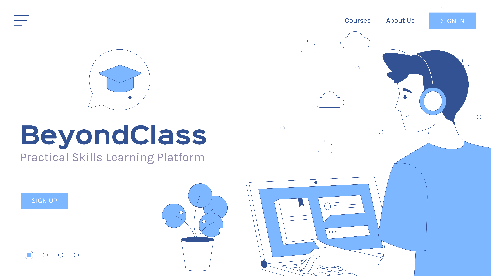

# **BeyondClass - A Practical Skills Learning Platform**

**BeyondClass**, a platform designed to help students gain real-world software development skills.





# **Problem Statement**
Today’s university curriculum focuses heavily on theory, but when students enter internships or jobs, they face a major gap. Most students struggle with practical tools like **Git, Linux, Docker, MERN, Laravel, and Spring Boot** that are essential in today’s software industry. 

Because of this lack of hands-on experience, students often feel unprepared, confused, and less confident in real-world work environments. Our project directly solves this gap between software industry.

Our solution is BeyondClass - Practical Skills Learning Platform. It is a web or mobile based platform that teaches real industry tools through curated videos, hands-on practice, AI feedback, and certificates.

Students follow step-by-step modules, complete practical tasks, receive instant feedback, and build a verified portfolio that they can use for internships and jobs.

# **Core Features**

We have three major **features**:

    1.	Module-Based Learning System
    2.	AI-Assisted Assignments & Auto-Grading
    3.	Skill Certificates & Portfolio Builder

# **Features Description**

**1. Module-Based Learning System**

    The platform is organized into practical, skill-focused modules such as Git, Linux, Bash, MERN, Laravel, and more.
    Workflow: Students pick a module → lessons appear in short, structured sections with curated videos → progress is tracked automatically as they learn at their own pace.

**2. AI-Assisted Assignments & Auto-Grading**

    Each module ends with an industry-style practical task.
    Workflow: Students submit code → the system tests it → AI provides instant, friendly feedback → students improve immediately.

**3. Certificates & Portfolio Builder**

    Students earn certificates to showcase their skills and build a professional identity.
    Workflow: Every completed module generates a skill certificate → completing all modules unlocks the full course certificate → all tasks and projects automatically appear in a shareable portfolio for teachers or employers.

# **Conclusion**
In conclusion, **BeyondClass** bridges the gap between theory and real-world practice. By giving students structured learning, hands-on tasks, AI support, certificates, and a portfolio, we make them job-ready and confident for real industry work.

# **Team Members**
> **Team BrainForge**

| Name                           |
| ------------------------------ |
|   Wasti Mohammad Khan          |
|   Sayed Mishkat Shariar Moon   |
|   A. M. Zayed Abdullah         |
|   Samira Bintey Haque          |


# **Faculty**
**S M Jishanul Islam**  
Part-time Faculty, Dept. of CSE  
United International University (UIU) | [Github](https://github.com/S-M-J-I) | [Mail](jishanul.ptfaculty@cse.uiu.ac.bd) 


# **Repository**
[github.com/amzayedabdullah/BeyondClass](https://github.com/amzayedabdullah/BeyondClass)

# **Setup**

```bash
git clone https://github.com/amzayedabdullah/BeyondClass.git
cd BeyondClass
pip install -r requirements.txt
```

---

> "Share your learning preferences - **BeyondClass** personalizes the journey for you""  
> Developed by **Team BrainForge**, UIU (2025)

---